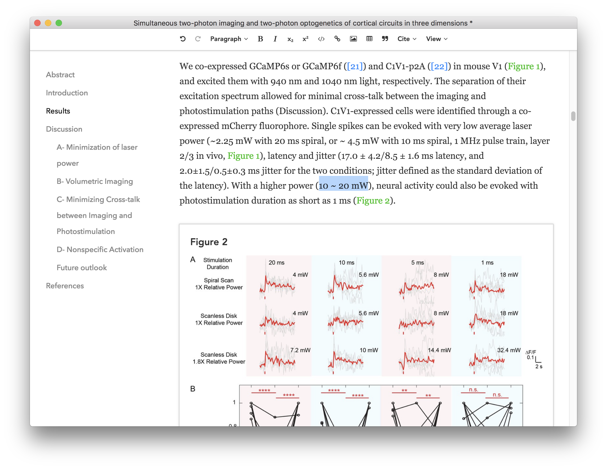

# Texture [](https://travis-ci.org/substance/texture)

Texture is a toolset designed for the production of scientific content. It uses the [Dar Format](http://github.com/substance/dar), which defines a stricter form of the [JATS Archiving and Interchange Tag Set ("green" v. 1.1)](https://jats.nlm.nih.gov/archiving/1.1/) XML standard.



## Roadmap

Texture is still in a beta stage: there are likely to be missing features, bugs and API changes. But we would :heart: to get your suggestions and :bug: reports.

- ✓ = ready for production use
- Beta = ready for beta user testing

We generally only plan one or two releases ahead, and aim ship regularly.

Feature                                 | Ready
:-------------------------------------- | :------------:
General editing                         | Beta
Copy & Paste (from Word, etc.)          | Beta
Find and Replace                        | Beta
Auto-numbered labels (`xref`, `fig`, etc. ) | Beta
Reference editing (`element-citation`)  | Beta
Authors and Affiliations                | Beta
[Dar](https://github.com/substance/dar) Storage | Beta
Article Record (`issue`, `fpage`, etc.) | September 2018
Translations                            | September 2018
Track Changes                           | September 2018
PubMed and CrossRef verification of references                           | September 2018
Fundref verification                    | September 2018
Group authors                           | September 2018
Realtime Collaborative Editing          |
**Supported Content**                   |
Paragraph                               | ✓
Heading                                 | ✓
Inline Formula                          | ✓
Display Formula                         | September 2018
List                                    | ✓
Blockquote                              | ✓
Figure                                  | ✓
Table                                   | Beta
Bold & Italic                           | ✓
Ext-Link                                | ✓
Subscript & Superscript                 | ✓


## Install

*You need Node 8.x installed on your system.*

Clone the repository.

```bash
$ git clone https://github.com/substance/texture.git
```

Navigate to the source directory.

```bash
$ cd texture
```

Install via npm.

```bash
$ npm install
```

Start the dev server.

```bash
$ npm start
```

And navigate to [http://localhost:4000](http://localhost:4000/?archive=kitchen-sink&storage=fs).

You can save your document changes by pressing `CommandOrControl+S`.

To test with your own JATS-documents, just replace the contents of `data/kitchen-sink/manuscript.xml`.

## Texture Desktop

We also offer Texture wrapped in an Electron application.

```bash
$ npm run app
```

To package the application for distribution do the following:

```bash
$ npm run release
```

## Running tests

Running tests in NodeJS (like it is done on TravisCI):

```bash
npm test
```

Debugging NodeJS tests:

```
node make test-nodejs && node --inspect-brk --require esm test/index.js
```
Then open `chrome://inspect`. It should show a `Remove Target` for the test script. Clicking on `inspect` opens a new window with Chrome Developer Tools.

Running a some NodeJS tests:

```
TEST="Model" npm test
```

The environment variable `TEST` is used as a filter to select test that have that pattern in their name.


Running tests in the browser:
```
node make test-browser -w -s
```
Then open `localhost:4000/test`.

## License

Texture is open source (MIT license), and you are legally free to use it commercially. If you are using Texture to make profit, we expect that you help [fund its development and maintenance](http://substance.io/consortium/).

## Credits

Texture is developed by the [Substance Consortium](http://substance.io/consortium/) formed by the [Public Knowledge Project](https://pkp.sfu.ca/2016/04/27/substance-consortium/) (PKP), the [Collaborative Knowledge Foundation](http://coko.foundation/blog.html#substance_consortium) (CoKo), [SciELO](http://www.scielo.org/),  [Érudit](https://apropos.erudit.org/fr/creation-dun-consortium-autour-de-substance/) and [eLife](https://elifesciences.org/).

The following people make Texture possible (in random order):

- Alex Garnett (leadership, concept)
- Juan Pablo Alperin (leadership, concept)
- Alex Smecher (concept, dev)
- Tanja Niemann (leadership)
- Melissa Harrison (requirements)
- Giuliano Maciocci (requirements, concept)
- Naomi Penfold (leadership)
- Nick Duffield (design)
- Davin Baragiotta (concept, dev)
- David Cormier (dev)
- Sophy Ouch (design)
- Philipp Zumstein (dev)
- Fabio Batalha Cunha dos Santos (leadership, concept)
- James Gilbert (UX, requirements)
- Luciano Gabriel Panepucci (UX)
- Michael Aufreiter (dev)
- Oliver Buchtala (dev)
- Daniel Beilinson (dev)
